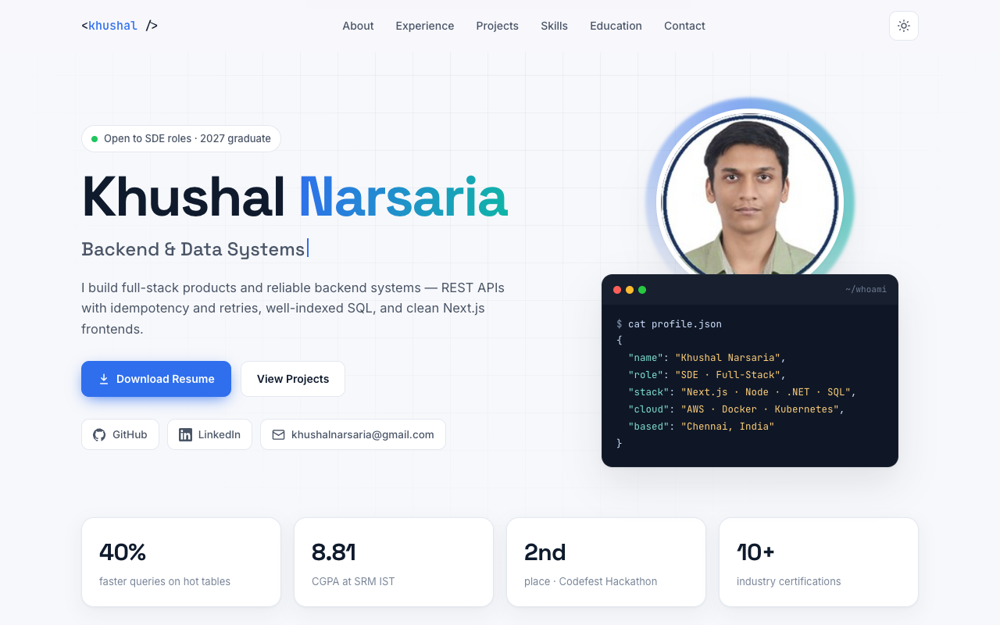

# Khushal Narsaria — Portfolio

[](https://khushal-narsaria.github.io/)


🔗 **Live site:** [khushal-narsaria.github.io](https://khushal-narsaria.github.io/) · 📄 **Resume:** [resume.pdf](https://khushal-narsaria.github.io/resume.pdf)

My personal portfolio: experience, featured projects with live demos, skills, education and certifications. It is a fast, dependency-free static site with light and dark themes, hosted on GitHub Pages.



## Features

- **Data-driven:** all content (about, experience, projects, skills, certifications) lives in [`data.js`](data.js). `script.js` renders it, so updating the site means editing one file.
- **Light/dark theme** that follows the system setting, with a manual toggle.
- **Project cards** with key metrics, tech tags and links to live demos and source code.
- **Responsive** layout down to phone width; no frameworks or build step.

## Structure

```
index.html     page skeleton
data.js        all portfolio content (edit this)
script.js      renders data.js, theme toggle, animations
style.css      styles (light and dark)
resume.pdf     downloadable resume
assets/        profile photo
```

## Run locally

```bash
python3 -m http.server 8000   # then open http://localhost:8000
```

Pushing to `main` publishes the site through GitHub Pages.
